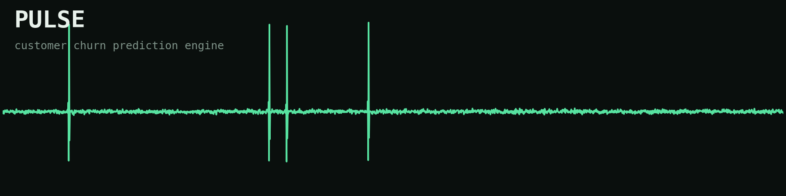
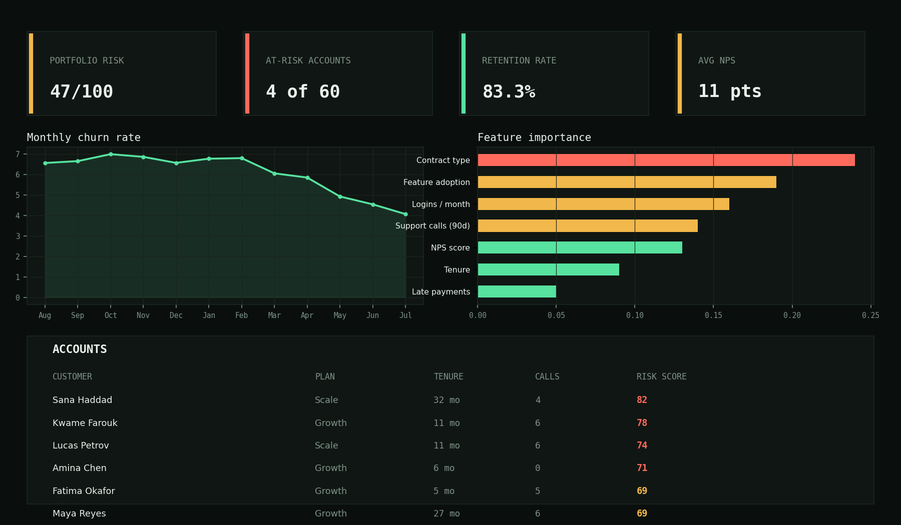
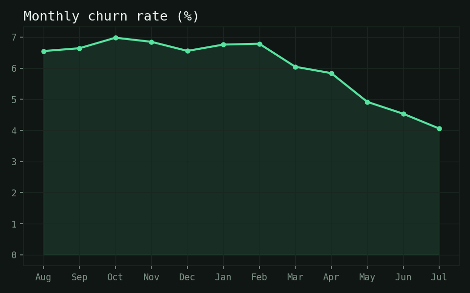
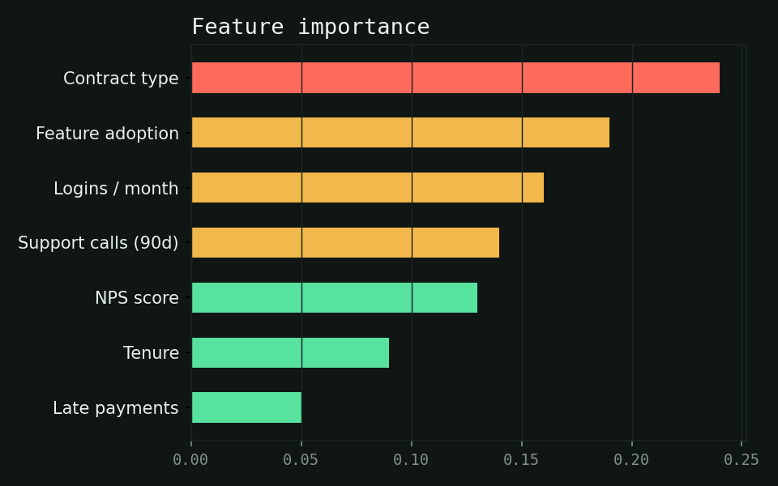

# Pulse — Customer Churn Prediction Engine



Pulse is a front-end dashboard that scores every customer account on their risk of churning, then surfaces the accounts that need attention before they cancel. It's built with plain HTML, CSS, and JavaScript — no build step, no backend — so it can be opened straight in a browser or hosted for free on GitHub Pages.

> All customer data in this repo (`data/customers.json`) is synthetically generated for demonstration purposes. No real customer information is included.

## Preview



| Churn rate trend | Feature importance |
|---|---|
|  |  |

## Features

- **Portfolio risk gauge** — a single at-a-glance score summarizing how healthy the customer base is right now.
- **Vitals KPIs** — total at-risk accounts, retention rate, and average NPS, computed live from the dataset.
- **Trend chart** — monthly churn rate over the trailing 12 months, rendered with Chart.js.
- **Feature importance chart** — the behavioral signals the risk model weighs most heavily.
- **Searchable, sortable, filterable accounts table** — filter by risk band (Stable / Elevated / Critical), search by name or account ID, and sort by any column.
- **Per-account breakdown** — click a row to see the specific risk factors (contract type, support load, sentiment, engagement) driving that customer's score.

## Project structure

```
customer-churn-prediction-engine/
├── index.html          # Page markup and layout
├── styles.css           # All styling (dark "vital signs monitor" theme)
├── script.js            # Data loading, scoring logic, charts, table interactions
├── data/
│   └── customers.json   # Synthetic customer dataset
├── images/               # Preview images used in this README
├── README.md
├── LICENSE
└── .gitignore
```

## Getting started

Because the dashboard fetches `data/customers.json` with the Fetch API, it needs to be served over `http://` rather than opened directly as a `file://` URL (browsers block local file fetches for security reasons).

**Option 1 — Python's built-in server**

```bash
cd customer-churn-prediction-engine
python3 -m http.server 8000
```

Then open `http://localhost:8000` in your browser.

**Option 2 — VS Code Live Server extension**

Right-click `index.html` and choose "Open with Live Server."

**Option 3 — GitHub Pages**

Push this repo to GitHub, then enable Pages under Settings → Pages, serving from the root of the `main` branch.

## How the risk score works

Each customer's `churn_risk_score` (0–100) is a weighted combination of seven signals:

| Signal | Why it matters |
|---|---|
| Contract type | Month-to-month customers churn far more often than annual contracts |
| Feature adoption | Low usage of core features signals the product hasn't become a habit |
| Logins per month | Drop-off in usage frequency often precedes cancellation |
| Support calls (90 days) | Repeated support contact can signal frustration |
| NPS score | Direct sentiment signal from the customer |
| Tenure | Newer accounts are statistically more likely to churn |
| Late payments | Billing friction correlates with disengagement |

In this demo, scores are pre-computed in `data/customers.json` to simulate what a trained model (e.g. logistic regression or gradient boosting) would output. Swap in real predictions by replacing that file with output from your own model, keeping the same field names.

## Customizing with your own data

Replace `data/customers.json` with an array of objects using this shape:

```json
{
  "id": "CUS-1000",
  "name": "Jane Doe",
  "plan": "Growth",
  "contract_type": "Month-to-month",
  "tenure_months": 14,
  "monthly_charges": 49.0,
  "support_calls_90d": 2,
  "nps_score": 10,
  "late_payments_12mo": 0,
  "logins_per_month": 12,
  "feature_adoption": 0.6,
  "churn_risk_score": 55,
  "churned_historically": false
}
```

No other code changes are required — the dashboard reads whatever is in the file.

## Built with

- HTML5 / CSS3 (no framework)
- Vanilla JavaScript
- [Chart.js](https://www.chartjs.org/) for the trend and feature-importance charts

## License

Released under the MIT License — see [LICENSE](LICENSE) for details.
